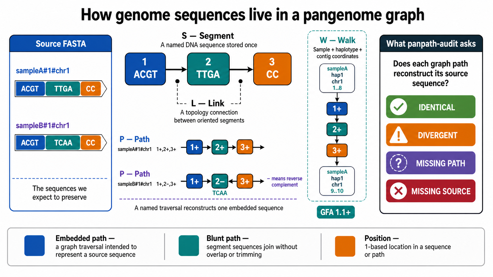

<p align="center">
  
</p>

<h1 align="center">panpath-audit</h1>

<p align="center">
  <em>Verify that a pangenome graph preserved your sequences.</em>
</p>

<p align="center">
  <a href="https://github.com/agkanogiannis/panpath-audit/actions/workflows/ci.yml"></a>
  <a href="LICENSE"></a>
  
</p>

`panpath-audit` checks that every genome or haplotype path embedded in a
pangenome graph reconstructs **exactly** the source FASTA sequence it is supposed
to represent, and tells you precisely where it doesn't.

## Why

Pangenome variation graphs (GFA) represent input genomes as paths through
sequence-labelled segments. Graph validators such as `odgi validate` check that a
graph is internally consistent, but a structurally valid graph can still encode
the *wrong* sequence. Reconstruction steps (POA re-walking, format conversions,
re-distribution of a different FASTA) can silently damage a path while leaving the
topology valid.

panpath-audit answers one binary question:

> Did this graph preserve my genomes?

It reconstructs each embedded path, compares it base-for-base against the source
FASTA, and reports the outcome with localized diagnostics and CI-grade exit codes.
It does **not** validate graph topology (that is a separate concern; see
[ADR-0003](docs/adr/0003-do-not-validate-graph-topology.md)); reports disclose
this explicitly.

## Features

- **GFA1 / GFA1.1**: `S` segments, `P` paths, and `W` walks
- **Plain or gzip** FASTA and GFA input
- **Exact IUPAC reverse-complement** for reverse-oriented segments (R↔Y, K↔M, B↔V, D↔H, …)
- **PanSN name join** (`sample#haplotype#contig`), with `--fasta-pansn` and `--fasta-prefix` mapping helpers
- **Blunt-path contract**: `*` overlaps treated as oriented concatenation ([ADR-0001](docs/adr/0001-treat-unspecified-path-overlaps-as-blunt.md))
- **Streaming with bounded memory** (`--memory-mib`) and **parallel** comparison (`--threads`)
- **Three report formats**: human, JSON, and TSV
- **Per-sequence digests**: SHA-256 and BLAKE3 over source, addressed source ranges, and reconstructed traversal (JSON/TSV)
- **Comprehensive statistics**: dual source/graph base ledgers plus bounded exact edit-distance alignment for divergent traversals

## Install

From source (requires Rust ≥ 1.89 / edition 2024):

```bash
cargo install panpath-audit      # install from crates.io
cargo build --release          # -> target/release/panpath-audit
cargo install --path .         # -> installs `panpath-audit`
```

## Usage

```bash
# Exact identifiers: FASTA header == graph path name
panpath-audit source.fa graph.gfa

# PanSN mapping: FASTA record `chr01` -> graph path `SAMPLE#1#chr01`
panpath-audit --fasta-pansn SAMPLE 1 source.fa graph.gfa

# Comprehensive JSON report (dual ledgers + digests + alignment)
panpath-audit --format json --stats comprehensive source.fa.gz graph.gfa.gz
```

Full option reference: [`docs/usage.md`](docs/usage.md) and `panpath-audit --help`.

## Example

```text
$ panpath-audit assemblies.fa.gz pangenome.gfa
PROVENANCE topology_validated=false unspecified_overlaps_as_blunt=true
MEMORY limit_mib=1024 peak_tracked_bytes=558010206 oversized_contigs=0
IDENTICAL 22
DIVERGENT 1
SampleA#1#chr02 source_position=1 path_position=1 source_length=55739602 path_length=55739602 segment=5+ traversal_position=1 segment_position=1
```

A divergence is localized to both the **source coordinate** and the **graph node**
(segment, orientation, and within-segment offset), not just "these differ".

Use it as a CI gate:

```bash
panpath-audit assemblies.fa.gz pangenome.gfa
echo "exit: $?"   # 0 = all paths identical
```

## Audit outcomes

| Outcome | Meaning |
|---|---|
| **Identical** | A source sequence and its paired embedded path have sequence identity (after case normalization; ambiguity codes must match exactly). |
| **Divergent** | The source and its paired path differ, or one is exhausted, at some position. |
| **Missing path** | A source sequence has no paired embedded path. |
| **Missing source** | An embedded path has no paired source sequence. |

## Exit codes

| Code | Meaning |
|---|---|
| `0` | clean (all identical) |
| `1` | divergent |
| `2` | missing or ambiguous correspondence |
| `3` | invalid GFA |
| `4` | source, usage, scratch, or operational failure |

When conditions coexist, the highest code takes precedence.

## How it works

<p align="center">
  
</p>

FASTA identifiers are indexed, then each graph traversal is streamed, its oriented
segment sequences reconstructed (reverse-complemented where required), and compared
against the paired source contig. Source FASTAs are read twice so memory is bounded
by the largest contig; graph segments and selected traversals stream through
anonymous temporary stores. Only first-divergence coordinates are retained. See
[`docs/adr/`](docs/adr/) for the design decisions and
[`CONTEXT.md`](CONTEXT.md) for the terminology.

## Development

```bash
cargo test                       # CLI test suite
cargo fmt --all -- --check
cargo clippy --all-targets -- -D warnings
cargo build --release
```

## Citation

If you use panpath-audit in your work, please cite it; see
[`CITATION.cff`](CITATION.cff) (GitHub shows a "Cite this repository" button).

## License

Apache-2.0. See [`LICENSE`](LICENSE) and [`NOTICE`](NOTICE).
